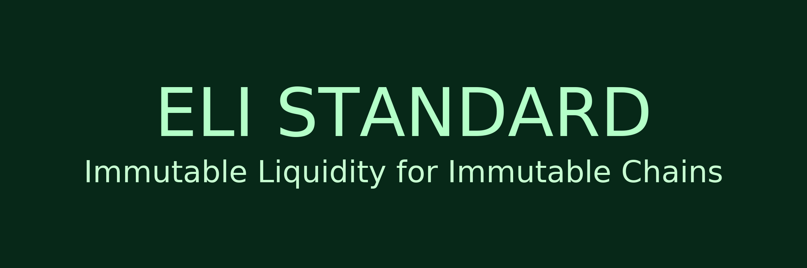

<p align="center">
  
</p>

# ELI V1 Liquidity Standard

**Repository:** `ELI-V1-Liquidity-Standard`  
**Standard:** ELI V1 – Eternal Liquidity Instrument  
**Tagline:** *Sound money deserves sound liquidity.*

---

## Overview

The **ELI Standard (Eternal Liquidity Instrument)** defines a liquidity and collateral framework for **immutable, Proof-of-Work chains**, with a primary focus on **Ethereum Classic (ETC)**.

ELI is a **social-layer and smart contract standard**, not a protocol fork. It describes how to structure liquidity, tokenomics, and DeFi architecture so that they *align with ETC’s core principles*:

- Immutability  
- Scarcity  
- Proof-of-Work security  
- Zero governance interference  
- Stewardship > control  

At its core, ELI is about:

> **Liquidity that is untouchable but usable.**  
> LP that cannot be moved or rugged, but can still power DEXes, collateral, and DeFi.

---

## Core Ideas

ELI V1 formalizes three main components:

### 1. PoBL – Proof of Burn Liquidity

**Proof of Burn Liquidity (PoBL)** is the act of **permanently burning LP tokens** to a dead wallet address so that:

- Liquidity cannot be withdrawn  
- Liquidity cannot be migrated  
- Liquidity cannot be governed or seized  
- Liquidity becomes *effectively immutable*

This turns liquidity into a **public good** secured by the chain itself, not by a team, DAO, or multisig.

### 2. PoBLBS – Proof of Burn Liquidity Balance Sheets

**PoBLBS** is the on-chain accounting layer that treats burned LP as:

- Verifiable reserves  
- A permanent collateral base  
- A transparent, immutable “balance sheet” for a token or protocol

It lets anyone calculate:

- How much ETC (and paired asset) is permanently locked  
- The effective minimum depth and baseline backing  
- The long-term collateral quality of an asset

### 3. ZG-DeFi / ZGF – Zero Governance DeFi / Zero Governance Finance

ELI is designed for **Zero Governance DeFi (ZG-DeFi)**:

- No DAO votes required to secure liquidity  
- No treasury management required to back the asset  
- No admin keys needed to “control” reserves  
- No L1 governance changes required

The **only “governance” is self-sovereignty**:  
Your “vote” is your token, backed by immutable LP burned to the dead wallet. Anyone can build on top of that base.

---

## Design Goals

ELI V1 is built around these goals:

- **Immutable Liquidity** – LP that cannot be rugged, migrated, or politically altered  
- **PoW Alignment** – Liquidity behavior that matches the economic reality of a finite, PoW chain (like ETC)  
- **Zero Governance** – No DAOs or treasuries required for the liquidity base itself  
- **Stewardship First Principles** – Builders act as stewards, not rulers; they commit liquidity, not control it  
- **Tokenomics Integrity** – Issuance and supply behavior must **never** undermine the burned LP base  
- **Slow, Strong Growth** – ELI systems favor slower but more secure, long-lived DeFi over fast, fragile models

---

## Who Is This For?

This repo is intended for:

- **ETC / PoW DeFi Developers** – designing tokens, DEXes, or protocols using immutable liquidity  
- **Token Issuers** – who want to commit to honest, non-rug, PoBL-based tokenomics  
- **Researchers & Economists** – exploring hard liquidity, PoW-aligned DeFi, and social-layer design  
- **ETC Community Members** – who want a formal reference for the ELI concept and architecture

---

## Repository Structure (Planned)

You can structure this repository like this:

```text
ELI-V1-Liquidity-Standard/
├─ README.md                # This file – overview & philosophy
├─ LICENSE                  # MIT License
├─ spec/
│  └─ ELI-V1.md             # Formal written specification of the standard
├─ docs/
│  ├─ overview.md           # High-level explanation of ELI, PoBL, PoBLBS, ZG-DeFi
│  ├─ design-principles.md  # Stewardship, sound liquidity, PoW alignment
│  └─ faq.md                # Common questions & answers
├─ examples/
│  ├─ example-tokenomics.md # Example ELI-compliant token design
│  └─ example-pobl-flow.md  # Step-by-step PoBL process
├─ ecip-draft/
│  └─ ecip-eli-standard.md  # Draft text if this evolves into an ECIP / ecosystem standard
└─ CONTRIBUTING.md          # Guidelines for discussion and contributions
